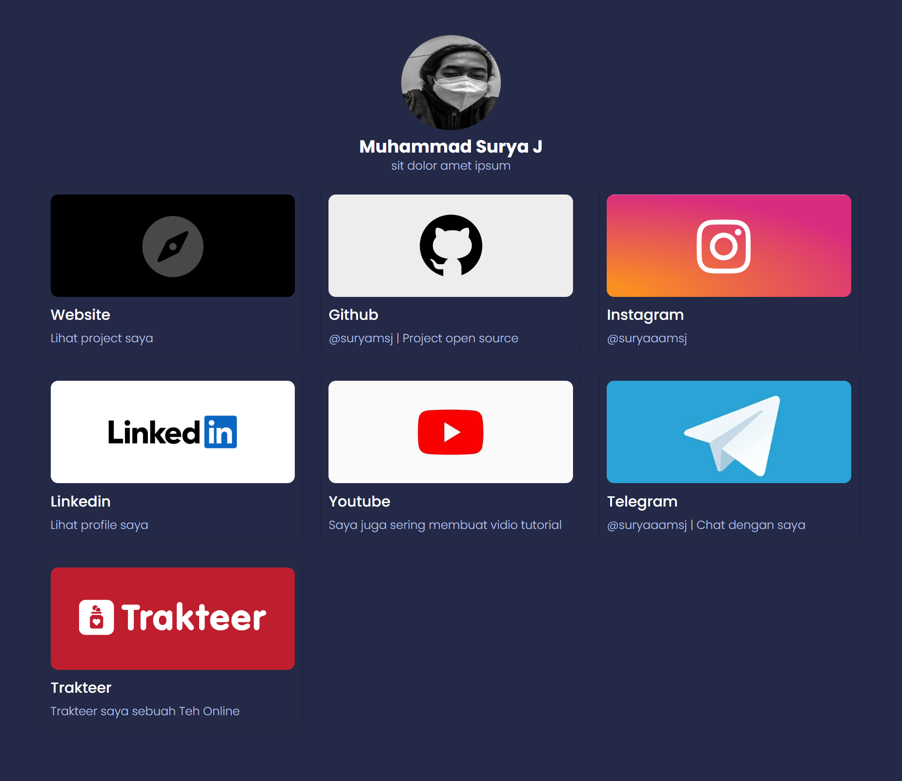

<div align="center" id="top"> 
  

&#xa0;

<a href="https://linkees.netlify.app">Demo</a>

</div>

<h1 align="center">Linkees</h1>

<p align="center">
  

  

  

  

  

  
</p>

<hr>

<p align="center">
  <a href="#dart-about">About</a> &#xa0; | &#xa0; 
  <a href="#rocket-technologies">Technologies</a> &#xa0; | &#xa0;
  <a href="#white_check_mark-requirements">Requirements</a> &#xa0; | &#xa0;
  <a href="#checkered_flag-starting">Starting</a> &#xa0; | &#xa0;
  <a href="#memo-license">License</a> &#xa0; | &#xa0;
  <a href="https://github.com/{{YOUR_GITHUB_USERNAME}}" target="_blank">Author</a>
</p>

<br>

## :dart: About

Linktree clone with Svelte.

## :rocket: Technologies

The following tools were used in this project:

- [Svelte](https://expo.io/)
- [Bootstrap](https://nodejs.org/en/)

## :white_check_mark: Requirements

Before starting :checkered_flag:, you need to have [Git](https://git-scm.com) and [Node](https://nodejs.org/en/) installed.

## :checkered_flag: Starting

```bash
# Clone this project
$ git clone https://github.com/suryamsj/linkees

# Access
$ cd linkees

# Install dependencies
$ npm install

# Run the project
$ npm run dev

# The server will initialize in the <http://localhost:3000>
```

## :memo: License

This project is under license from MIT. For more details, see the [LICENSE](LICENSE.md) file.

Made with :heart: by <a href="https://github.com/{{YOUR_GITHUB_USERNAME}}" target="_blank">Muhammad Surya J</a>

&#xa0;

<a href="#top">Back to top</a>
